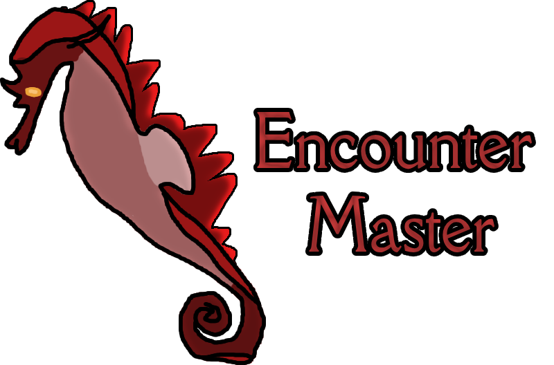

# EncounterMaster
A D&D 5e encounter manager with creature editing, and sharing.
[](https://github.com/Kade-github/EncounterMaster/actions/workflows/cmake.yml)

## Features
- Use existing stat blocks as a base.
- Create, edit, and delete creatures with stats, abilities, and actions.
- Save and load encounters with multiple creatures.

## Download
You can download the latest release of EncounterMaster from the [Releases](https://github.com/Kade-github/EncounterMaster/releases/latest) page.

## Building from Source
### Prerequisites
- CMake 3.15 or higher
- A C++ compiler that supports C++17
- VCPKG for dependency management

### Steps
1. Clone the repo.
2. Initialize and update submodules:
   ```bash
   git submodule update --init --recursive
   ```
3. Install dependencies using VCPKG:
   ```bash
   vcpkg install
   ```
4. CMake configuration:
   ```bash
   cmake -B build -S .
   ```
5. Build the project:
   ```bash
   cmake --build build
   ```

Or, you can use visual studio or something lol.